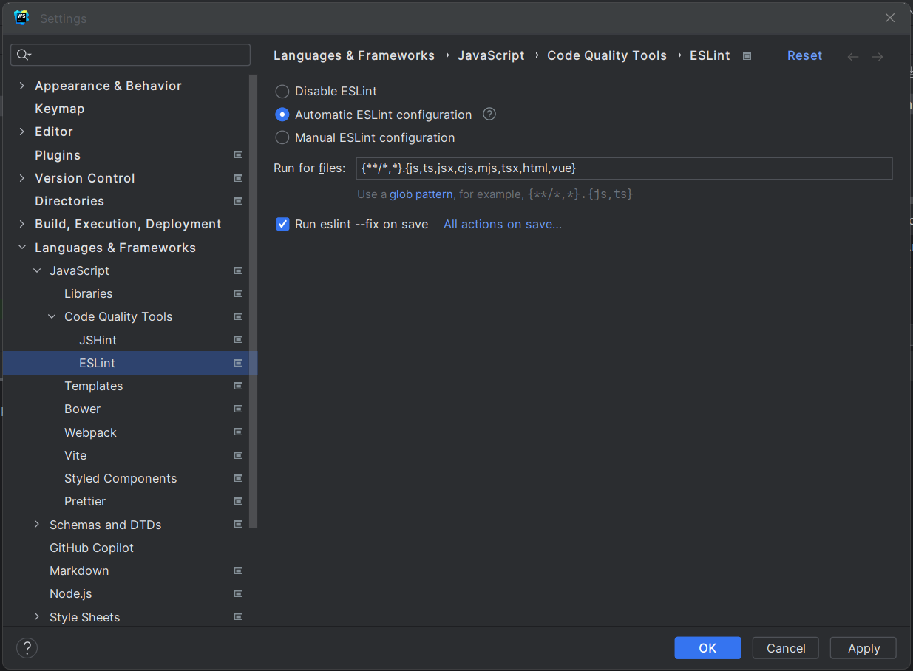

## Description

Utilizing **ESLint**, **Prettier**, and **TypeScript** in your projects brings a powerful combination of benefits that enhance code quality, readability, and developer productivity.

To streamline this process, Kiskadee offers three levels of pre-configured ESLint settings for different types of projects, including **JavaScript/Node**, **React**, and **React Native**. Each level represents a set of rules that can be applied to your project, allowing you to choose the level that best suits your needs:

- **Level 1** provides a solid foundation with the recommended settings of each respective plugin for **TypeScript**, **Airbnb's JavaScript Style Guide**, and **Prettier**. This level is perfect for starting projects with the basics, allowing you to later configure rules to your liking and add other plugins.
- **Level 2** offers a more complete solution, adding the **Unicorn plugin** with over 100 rules, the **Unused Imports plugin** to remove unused imports, and the **No Relative Import Paths plugin** to enforce the use of absolute import paths. This level is ideal for projects that require more extensive rule coverage.
- **Level 3** focuses on adjusting existing rules to find the perfect middle ground between being overly strict or too lenient, **promoting harmony and uniformity among the multiple plugins** used in your project. This level is well-suited for projects that need a finely tuned and balanced set of rules.
  In essence, **level 1** uses only essential plugins, **level 2** includes additional plugins, and **level 3** modifies some rules for balance. With Kiskadee, configuring **ESLint**, **Prettier**, and **TypeScript** becomes a breeze, offering different levels of configuration to cater to your project's specific needs. This streamlined setup allows your team to focus on writing great code, maintaining a high standard of code quality across the entire project.

## 🗂️ Summary

- [Requirements](https://github.com/kiskadee-studio/eslint-config-kiskadee#requirements)
- Kiskadee Setups:
  - [JavaScript Level 1 - Essential rules](https://github.com/kiskadee-studio/eslint-config-kiskadee#-essential-javascript-rules---level-1)
  - [JavaScript Level 2 - Great rules](https://github.com/kiskadee-studio/eslint-config-kiskadee#-great-javascript-rules---level-2)
  - [JavaScript Level 3 - Kiskadee rules](https://github.com/kiskadee-studio/eslint-config-kiskadee#-kiskadee-javascript-rules---level-3)
  - [React Level 1 - Essential rules](https://github.com/kiskadee-studio/eslint-config-kiskadee#-essential-react-rules---level-1)
  - [React Level 2 - Great rules](https://github.com/kiskadee-studio/eslint-config-kiskadee#-great-react-rules---level-2)
  - [React Level 3 - Kiskadee rules](https://github.com/kiskadee-studio/eslint-config-kiskadee#-kiskadee-react-rules---level-3)
  - JSON
  - Cypress - soon
  - Detox - soon
  - JSDoc - soon
- Bonus Setup:
  - [EditorConfig](https://github.com/kiskadee-studio/eslint-config-kiskadee#editorconfig)
  - Prettier - soon
- IDE/Editor Setup:
  - [WebStorm](https://github.com/kiskadee-studio/eslint-config-kiskadee#webstorm)
  - [VS Code](https://github.com/kiskadee-studio/eslint-config-kiskadee#vs-code)

## Requirements

As we use TypeScript by default at all levels, you should have a `tsconfig.json` file ***at the root*** of your project for the **ESLint plugin for TypeScript** to work properly. If you don't have a **tsconfig.json** file, you can create one with the `tsc --init` command or access the [documentation](https://www.typescriptlang.org/docs/handbook/tsconfig-json.html) for more details.

## 🔧 ESLint Setup for JavaScript / Node

### 📖 Essential JavaScript Rules - Level 1

- 🧰 **Airbnb: JavaScript Style Guide**
  - _JavaScript Plugin ([eslint-config-airbnb-base](https://www.npmjs.com/package/eslint-config-airbnb-base))_
  - *Import Plugin ([eslint-plugin-import](https://github.com/import-js/eslint-plugin-import))*
- 🧰 **TypeScript Support**
  - *TypeScript Plugin ([typescript](https://github.com/Microsoft/TypeScript#installing) [@typescript-eslint](https://typescript-eslint.io/getting-started/#step-2-configuration))*
  - *Fixed conflicts among different rules ([eslint-config-kiskadee](https://github.com/kiskadee-studio/eslint-config-kiskadee#installation) [eslint-import-resolver-typescript](https://github.com/import-js/eslint-import-resolver-typescript))*
- 🧰 **Prettier Support**
  - _Prettier Plugin ([prettier](https://prettier.io/docs/en/install.html) [eslint-plugin-prettier](https://github.com/prettier/eslint-plugin-prettier#recommended-configuration))_
  - *Fixed conflicts among different rules ([eslint-config-prettier](https://github.com/prettier/eslint-config-prettier#installation))*
- 🧰 **Testing Support**
  - *Vitest Plugin ([vitest](https://vitest.dev/guide/#adding-vitest-to-your-project) [eslint-plugin-vitest](https://github.com/veritem/eslint-plugin-vitest#installation))*

#### Installation

In your **terminal**, run the command below to install the necessary dependencies:

```bash
  npm i -D eslint eslint-config-kiskadee eslint-config-airbnb-base eslint-plugin-import typescript @typescript-eslint/parser @typescript-eslint/eslint-plugin prettier eslint-plugin-prettier eslint-config-prettier vitest eslint-plugin-vitest
```

#### Usage

Create a `.eslintrc.js` file ([or equivalent](https://eslint.org/docs/latest/use/configure/configuration-files#configuration-file-formats)) ***at the root*** of your project and extend `kiskadee/node-level-1`:

```javascript
  module.exports = {
    extends: ['kiskadee/node-level-1'],
    rules: {
      // your rules
    },
  };
```

### 📖 Great JavaScript Rules - Level 2

- 🔥 **All items from level 1**
- 🧰 **Unicorn Plugin** ([eslint-plugin-unicorn](https://github.com/sindresorhus/eslint-plugin-unicorn#recommended-config))
  - _More than 100 powerful ESLint rules_
- 🧰 **Unused Imports Plugin** ([eslint-plugin-unused-imports](https://github.com/sweepline/eslint-plugin-unused-imports#usage))
  - _Finds and removes unused ES6 module imports_
- 🧰 **No Relative Import Paths Plugin** ([eslint-plugin-no-relative-import-paths](https://github.com/MelvinVermeer/eslint-plugin-no-relative-import-paths#configuration))
  - _Enforces the use of absolute import paths_

#### Installation

After installing the dependencies for [level 1](https://github.com/kiskadee-studio/eslint-config-kiskadee#-essential-javascript-rules---level-1)), then install:

```bash
  npm i -D eslint-plugin-unicorn eslint-plugin-unused-imports eslint-plugin-no-relative-import-paths
```

#### Usage

Create a `.eslintrc.js` file ([or equivalent](https://eslint.org/docs/latest/use/configure/configuration-files#configuration-file-formats)) ***at the root*** of your project and extend `kiskadee/node-level-2`:

```javascript
    module.exports = {
      extends: ['kiskadee/node-level-2'],
      rules: {
        // your rules
      },
    };
```

### 📖 Kiskadee JavaScript Rules - Level 3

- 🔥 **All items from level 2**
- 🚀 **A selection of outstanding rules we've recommended, derived from existing plugins**

#### Installation

Install the dependencies for [level 2](https://github.com/kiskadee-studio/eslint-config-kiskadee#-essential-javascript-rules---level-2)).

#### Usage

Create a `.eslintrc.js` file ([or equivalent](https://eslint.org/docs/latest/use/configure/configuration-files#configuration-file-formats)) ***at the root*** of your project and extend `kiskadee/node-level-3`:

```javascript
    module.exports = {
      extends: ['kiskadee/node-level-3'],
      rules: {
        // your rules
      },
    };
```

> Don't hesitate to start a new issue with suggestions for new plugins or a specific configuration for any of the plugins we already have.

# 🔧 ESLint Setup for React

### 📖 Essential React Rules - Level 1

- 🧰 **Airbnb: React Style Guide**
  - _React and JavaScript Plugin ([eslint-config-airbnb](https://www.npmjs.com/package/eslint-config-airbnb-base))_
  - _React Plugin ([eslint-plugin-react](https://github.com/jsx-eslint/eslint-plugin-react))_
  - _React Hooks Plugin ([eslint-plugin-react-hooks](https://www.npmjs.com/package/eslint-plugin-react-hooks))_
  - _Import Plugin ([eslint-plugin-import](https://github.com/import-js/eslint-plugin-import))_
  - JSX Accessibility Plugin ([eslint-plugin-jsx-a11y](https://github.com/jsx-eslint/eslint-plugin-jsx-a11y))
- 🧰 **TypeScript Support**
  - *TypeScript Plugin ([typescript](https://github.com/Microsoft/TypeScript#installing) [@typescript-eslint](https://typescript-eslint.io/getting-started/#step-2-configuration))*
  - *Fixed conflicts among different rules ([eslint-config-kiskadee](https://github.com/kiskadee-studio/eslint-config-kiskadee#installation) [eslint-import-resolver-typescript](https://github.com/import-js/eslint-import-resolver-typescript))*
- 🧰 **Prettier Support**
  - Prettier Plugin ([prettier](https://prettier.io/docs/en/install.html) [eslint-plugin-prettier](https://github.com/prettier/eslint-plugin-prettier#recommended-configuration))
  - _*Fixed conflicts among different rules ([eslint-config-prettier](https://github.com/prettier/eslint-config-prettier#installation))*_
- 🧰 **Testing Support**
  - *Vitest Plugin ([vitest](https://vitest.dev/guide/#adding-vitest-to-your-project) [eslint-plugin-vitest](https://github.com/veritem/eslint-plugin-vitest#installation))*
  - *Testing Library ([eslint-plugin-testing-library](https://github.com/testing-library/eslint-plugin-testing-library#react))*

#### Installation

```bash
  npm i -D eslint eslint-config-kiskadee eslint-config-airbnb eslint-plugin-import typescript @typescript-eslint/parser @typescript-eslint/eslint-plugin prettier eslint-plugin-prettier eslint-config-prettier vitest eslint-plugin-vitest eslint-plugin-testing-library
```

If you are using `React Native`, install this complementary dependency:

```bash
  npm i -D @react-native/eslint-plugin
```

#### Usage

Create a `.eslintrc.js` file ([or equivalent](https://eslint.org/docs/latest/use/configure/configuration-files#configuration-file-formats)) ***at the root*** of your project and extend `kiskadee/react-level-1` (or `kiskadee/react-native-level-1`):

```javascript
    module.exports = {
      extends: ['kiskadee/react-level-1'], // ['kiskadee/react-native-level-1'] for React Native projects
      rules: {
        // your rules
      },
    };
```

> **Note:** As we use TypeScript by default at all levels, you should have a `tsconfig.json` file ***at the root*** of your project for the ESLint plugin for TypeScript to work properly. If you don't have a **tsconfig.json** file, you can create one with the `tsc --init` command or access the [documentation](https://www.typescriptlang.org/docs/handbook/tsconfig-json.html) for more details.

### 📖 Great React Rules - Level 2

- 🔥 **All items from level 1**
- 🧰 **Unicorn Plugin** ([eslint-plugin-unicorn](https://github.com/sindresorhus/eslint-plugin-unicorn#recommended-config))
  - _More than 100 powerful ESLint rules_
- 🧰 **Unused Imports Plugin** ([eslint-plugin-unused-imports](https://github.com/sweepline/eslint-plugin-unused-imports#usage))
  - _Finds and removes unused ES6 module imports_
- 🧰 **No Relative Import Paths Plugin** ([eslint-plugin-no-relative-import-paths](https://github.com/MelvinVermeer/eslint-plugin-no-relative-import-paths#configuration))
  - _Enforces the use of absolute import paths_

```bash
npm i -D eslint-plugin-unicorn eslint-plugin-unused-imports eslint-plugin-no-relative-import-paths eslint-plugin-jsonc
```

#### Usage

```javascript
    module.exports = {
      extends: ['kiskadee/react-level-2'], // ['kiskadee/react-native-level-2'] for React Native projects
      rules: {
        // your rules
      },
    };
```

### 📖 Kiskadee React Rules - Level 3

- 🔥 **All items from level 2**
- 🚀 **A selection of outstanding rules we've recommended, derived from existing plugins**

#### Usage

```javascript
    module.exports = {
      extends: ['kiskadee/react-level-3'], // ['kiskadee/react-native-level-3'] for React Native projects
      rules: {
        // your rules
      },
    };
```

> Don't hesitate to start a new issue with suggestions for new plugins or a specific configuration for any of the plugins we already have.

## JSON Support

Às vezes você pode alterar seu package.json ou algum arquivo de mock (.json) e percebe as coisas estão ficando desalinhadas, fora de padrão, apesar de você poder lidar com isso apenas com Prettier, nós achamos que é mais prático usar o ESLint para para lidar com arquivos .json, ,jsonc e .json5 com o auxílio das regras do plugin JSONC e formatação do Prettier

Aqui você encontra:

- Suporte a arquivos .json, .jsonc e .json5
- Formatação do Prettier para JSON
- Regras do plugin JSONC ([eslint-plugin-jsonc](https://github.com/ota-meshi/eslint-plugin-jsonc#configuration))
- Correção de conflitos entre JSONC e Prettier

### Installation for JSON

```bash
npm i -D eslint-plugin-jsonc
```

### Usage for JSON

Adicione `kiskadee/json` à propriedade `extends` do seu arquivo `.eslintrc.js` ([or equivalent](https://eslint.org/docs/latest/use/configure/configuration-files#configuration-file-formats)):

```javascript
    // .eslintrc.js
    module.exports = {
      extends: ['kiskadee/react-level-3', 'kiskadee/json'],
      rules: {
        // your rules
      },
    };
```

## .editorconfig

Though ESLint and Prettier are independent tools, each serving its own purpose, they share some common features with the [editorconfig](https://editorconfig.org/). While Prettier excels at standardizing code formatting aspects, primarily for JavaScript files, the significance of the `.editorconfig` file extends beyond specific programming languages. It helps maintain consistency in coding style and formatting across different development environments, including various IDEs, text editors, and operating systems.

Some examples of the capabilities offered by both Prettier and EditorConfig include:

- Setting indentation style (spaces or tabs) and size.
- Controlling end-of-line (EOL) characters (LF, CR, or CRLF).
- Ensuring a newline is inserted at the end of a file.
- Specifying whether to remove trailing whitespace.

By utilizing the .editorconfig file, developers can establish a consistent code style and formatting standard that remains uniform across different IDEs, text editors, and operating systems. This promotes collaboration and enhances code readability throughout the project.

Create a `.editorconfig` file in the project root with the following content:

```bash
root = true

[*]
charset = utf-8
indent_style = space
indent_size = 2
end_of_line = lf
insert_final_newline = true
trim_trailing_whitespace = true
max_line_length = 80
```

> **For Windows Users**: you may encounter problems when trying to change the line ending in Git. If this happens, try following [these steps](https://docs.github.com/en/get-started/getting-started-with-git/configuring-git-to-handle-line-endings).

## WebStorm

#### ESLint

Go to **_Settings_** > **_Languages & Frameworks_** > **_JavaScript_** > **_Code Quality Tools_** > **_ESLint_**, check **"Run eslint --fix on save"**, and if you use JavaScript files with the extensions `.cjs` or `.mjs`, add them to **"Run for files"**.



#### EditorConfig

WebStorm has native support for `.editorconfig`.

## VS Code

#### ESLint

[Install](https://code.visualstudio.com/learn/get-started/extensions) the [ESLint](https://marketplace.visualstudio.com/items?itemName=dbaeumer.vscode-eslint) extension _by Microsoft_, which will allow us to run ESLint on save. Then, in your [settings.json](https://code.visualstudio.com/docs/getstarted/settings#_settingsjson) file, add the following configuration:

```json
{
  "editor.codeActionsOnSave": {
    "source.fixAll.eslint": true
  }
}
```

#### JSON Plugin

If you are using the JSON plugin, you need to specify the file extension type in your [settings.json](https://code.visualstudio.com/docs/getstarted/settings#_settingsjson) file. Since ESLint was initially created only for .js files, let's add the JSON extensions along with other standard extensions:

```json
{
  "eslint.validate": ["javascript", "javascriptreact", "typescript", "typescriptreact", "json", "jsonc", "json5"]
}
```

> VS Code doesn't support `.json5` files, but it does support `.jsonc`, which interestingly is also from Microsoft. If your `.json5` file appears in **a single color**, indicating that the editor doesn't recognize the format, you can simply use the **_Ctrl/Cmd + Shift + P_** shortcut and type **"Change Language Mode"** or click on **"Plain Text" (Language Mode)** at the bottom right of VS Code and search for **"JSON with Comments"**. This way, we make VS Code treat `.json5` files as if they were `.jsonc` files.

#### EditorConfig

For `.editorconfig` support, [use](https://code.visualstudio.com/learn/get-started/extensions) the [EditorConfig for VS Code](https://marketplace.visualstudio.com/items?itemName=EditorConfig.EditorConfig) extension.
